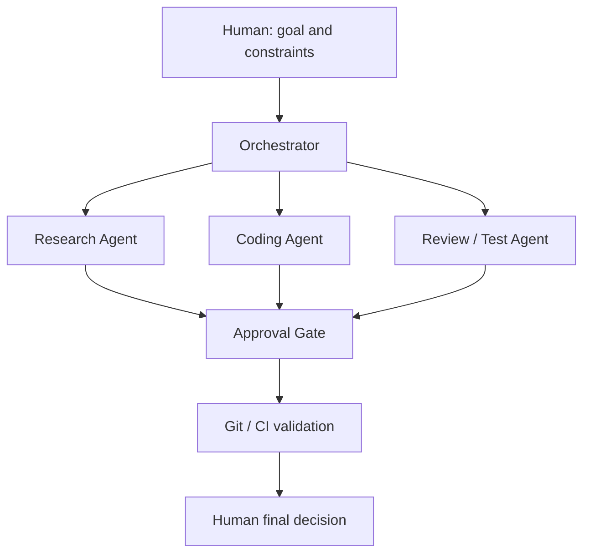

# AI Agent Engineering Case Study

AIエージェントを、ソフトウェア開発と業務自動化の工程へ安全に組み込むための、**個人開発環境での設計・検証ケーススタディ**です。

> 公開可能な設計・検証内容を、Privateプロジェクトから独立して一般化したケーススタディです。実装状況と主張の範囲は、本文の「実装状況と主張の境界」に明示しています。

## 3分で分かること

- AIにすべてを任せず、**人間が重要判断を保持する**開発ワークフロー
- Research / Coding / Review / Test の役割分担と、必要最小限のコンテキスト共有
- 承認ゲート、終了条件、Git、CIを組み合わせた品質・安全性の管理
- 要件・利用シナリオ・受入条件を、バックログ、Issue、PR、CIへつなげるMVP管理
- 「実装済みの証拠」と「設計・検証中の内容」を分け、誇張しない公開方針

## 解決したい課題

AIエージェントは調査・実装・レビューを加速できますが、無制限に自律実行させると、誤った前提のまま進むこと、秘密情報の取り扱い、意図しない外部操作、品質低下を招きます。

このケーススタディでは、AIの作業速度を活かしながら、重要な意思決定・外部確定操作・公開判断を人間に残す設計を扱います。

## Agent roles

| Role | Responsibility | Must not decide alone |
| --- | --- | --- |
| Orchestrator | Goalを作業単位へ分解し、進行・停止条件を管理する | 重要な方針変更、外部確定操作 |
| Research Agent | 一次情報を優先して調査し、根拠と不確実性を整理する | 事実未確認の結論、機密情報の外部共有 |
| Coding Agent | 承認された要件に沿って、変更案と検証方法を作る | 変更の公開、認証情報の扱い、仕様の独断変更 |
| Review / Test Agent | 差分、テスト、受入条件、失敗時の影響を確認する | 品質未達の例外承認 |
| Human | 目的・制約・承認・公開・最終判断を行う | — |

## 品質と安全性の考え方

- 役割ごとにコンテキストを分離し、不要な情報を渡さない
- 外部送信、公開、契約、金額・納期確約、納品・決済などは承認ゲートを必須にする
- Gitで変更履歴を残し、AIの提案は差分として確認する
- CI・テスト・受入条件を、変更の客観的な検証点にする
- 目標達成だけでなく、失敗・品質未達・データ不足でも安全に停止する

## 実装状況と主張の境界

| 項目 | このケーススタディでの位置付け |
| --- | --- |
| 役割分担・承認・終了条件 | 個人開発環境で設計・検証しているワークフロー |
| 要件整理・MVP設計・受入条件 | 個人開発で実践している管理観点。公開資料では一般化したサンプルとして示す |
| Gitによる変更履歴・差分確認 | 開発運用の方針として実践 |
| CI・Pythonユニットテスト | [ProjectControl Portfolio](https://github.com/monaka-77/project-control-portfolio)で公開済みの実装証拠 |
| LLM API、RAG、MCPサーバーの実装 | このケーススタディでは主張しない。範囲外 |
| 本番運用・顧客導入・利用者数 | 主張しない。範囲外 |

## 詳細資料

1. [アーキテクチャと境界](docs/architecture.md)
2. [Agent / Sub-Agentワークフローと終了条件](docs/agent-workflow.md)
3. [安全性と承認ゲート](docs/safety-and-approval.md)
4. [評価と受入基準](docs/evaluation.md)
5. [公開上の主張境界](docs/claim-boundaries.md)
6. [要件定義・MVP管理の実践サンプル](docs/requirements-mvp-management.md)

## 関連ポートフォリオ

- [ProjectControl Portfolio](https://github.com/monaka-77/project-control-portfolio)：Python、設計、テスト、CI、安全なデータ更新の実装証拠
- [GitHub Profile](https://github.com/monaka-77)：AI Agent × Software Engineering × Business Automation の全体像
