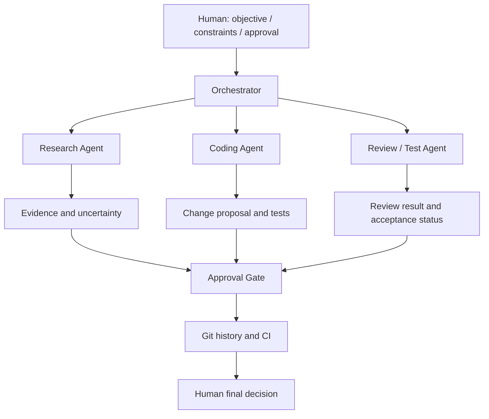

# アーキテクチャと境界

## 設計目的

AIエージェントを「最終決定者」ではなく、役割を限定した作業支援者として扱います。目的は、調査・実装・確認を効率化しつつ、意図しない変更・公開・外部操作を防ぐことです。

## 論理構成

## コンテキスト分離

各Agentは、目的達成に必要な最小限の情報だけを扱います。

| Agent | 入力 | 出力 | 分離の理由 |
| --- | --- | --- | --- |
| Research | 調査目的、公開可能な条件 | 根拠、要約、不確実性 | 実装・秘密情報を不要に広げない |
| Coding | 承認済み要件、対象範囲、受入条件 | 差分案、テスト案、影響範囲 | 調査ノイズや不要な認証情報を渡さない |
| Review / Test | 変更差分、受入条件、テスト結果 | 合否、懸念、未確認事項 | 目的変更や公開判断を委任しない |

## 信頼境界

- **人間の管理領域**：目的、優先順位、予算、公開範囲、外部確定操作、最終判断
- **AIの支援領域**：調査整理、実装案、差分説明、テスト観点、文書化
- **Git / CIの検証境界**：変更履歴、レビュー対象の固定、再現可能な自動検証
- **Private情報の境界**：コード、URL、インフラ、API情報、認証情報、実データ、顧客情報、内部設計は公開資料に含めない

この資料は一般化した設計説明です。特定のPrivateプロジェクトの構成・接続先・設定値を再現するものではありません。
