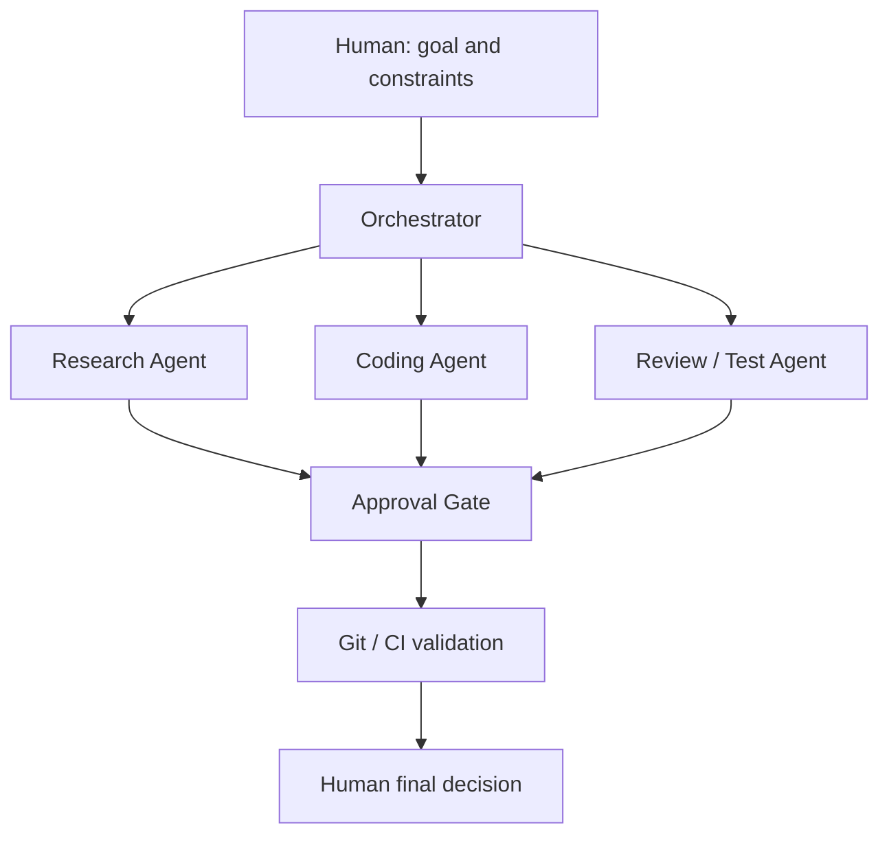

# ワークフロー図

```mermaid
flowchart TD
    H["Human: goal and constraints"] --> O["Orchestrator"]
    O --> R["Research Agent"]
    O --> C["Coding Agent"]
    O --> V["Review / Test Agent"]
    R --> G["Approval Gate"]
    C --> G
    V --> G
    G --> CI["Git / CI validation"]
    CI --> D["Human final decision"]
```
