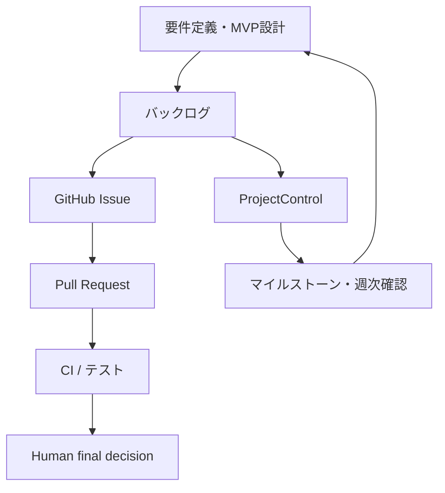

# 要件定義・MVP管理の実践サンプル

## この資料の位置付け

個人開発で行っている、要件整理・MVP設計・進捗確認の観点を、公開可能な形に一般化したサンプルです。

特定のPrivateプロジェクトの要件定義書、ソースコード、URL、認証情報、実データ、内部設計は含めません。実プロジェクト名を伏せた架空のMVP例で、考え方と管理のつながりだけを示します。

> チーム案件における要件定義の主担当経験や、顧客導入・本番運用を主張する資料ではありません。個人開発で、要件を実装・検証可能な単位へ整理している実践例です。

## 3分で分かること

- 目的・対象ユーザー・スコープ・非対象範囲を、実装前に分けて整理する
- 利用シナリオと受入条件を定義し、「何ができれば完了か」を曖昧にしない
- バックログ、マイルストーン、日常タスク、GitHub Issue / PR / CIの役割を重複させない
- AI Agentへ作業を渡す前に、人間が目的・制約・受入条件を確定する
- Private情報を公開用資料へ混ぜない

## 管理対象と正本の分担

| 管理対象 | 主な場所 | 役割 |
| --- | --- | --- |
| 要件・MVPの判断 | 要件定義・MVP設計シート | 誰のどの課題を、どこまで解くかを決める |
| 実装候補と優先順位 | バックログ | 作業候補を小さく分け、優先順位を付ける |
| 到達点と完了判断 | マイルストーン | MVPとして何を確認できれば次へ進むかを決める |
| 日々のタスク・進捗 | ProjectControl | 優先順位、期限、承認状態、進捗を管理する |
| 変更単位 | GitHub Issue | 変更目的、完了条件、議論を固定する |
| 変更提案とレビュー | Pull Request | 差分、レビュー、検証結果を確認する |
| 自動検証 | CI / テスト | 変更が受入条件・品質条件を満たすか確認する |
| 最終決定 | Human | 目的変更、公開、外部操作、品質例外を判断する |

同じ内容を複数の場所で更新するのではなく、用途ごとに正本を分けます。

## 要件を整理する順序

| 観点 | 確認すること | 曖昧なまま進めた場合のリスク |
| --- | --- | --- |
| 背景・課題 | なぜ今このMVPが必要か | 目的と無関係な機能が増える |
| 対象ユーザー | 誰の、どの場面の困りごとか | 想定利用者がぼやける |
| 提供価値 | 使った後に何ができるようになるか | 機能を作っても価値を説明できない |
| 利用シナリオ | 利用者がどの順番で行動するか | 導線や必要情報を見落とす |
| スコープ | 今回のMVPで作る範囲 | 実装量が膨らむ |
| 非対象範囲 | 今回は作らないもの | 優先順位が崩れる |
| 受入条件 | 何を確認できれば完了か | 「ほぼできた」のまま止まる |
| 品質・安全条件 | テスト、表示確認、秘密情報、公開判断 | 変更の安全性を説明できない |
| 前提・制約・未決定事項 | 依存関係、制約、保留中の判断 | 暗黙の前提で手戻りが起きる |

## 一般化したMVP例

以下は実プロジェクトの内容ではありません。要件と検証を対応付けるための架空例です。

| 項目 | 内容 |
| --- | --- |
| 背景・課題 | 利用者が必要な情報へ短時間で到達できず、次の行動を判断しにくい |
| 対象ユーザー | 旅行前または旅行中に、必要な情報を確認したい個人利用者 |
| 今回のMVPで提供すること | 1つのテーマに絞った情報ページと、主要な案内導線 |
| 今回やらないこと | 大規模な自動化、不要な外部連携、実データを伴う高度な個別最適化 |
| 利用シナリオ | 利用者が「探す → 読む → 次の行動を決める」まで到達できる |
| 受入条件 | 主要導線・表示・リンクを確認でき、利用シナリオに沿って必要情報へ到達できる |
| 品質・安全条件 | 秘密情報を含めない。変更をGitで管理し、必要なテスト・CI・表示確認後に人間が公開可否を判断する |
| 前提・制約 | 実データ、認証情報、内部URLは公開資料・テストデータへ混ぜない |

## 受入条件を実装・検証へつなげる

受入条件は、要望を「確認可能な状態」に変換するためのものです。

| 要件 | 受入条件 | 確認方法 | 判断者 |
| --- | --- | --- | --- |
| 利用者が必要情報へ到達できる | 主要導線から対象情報へ到達できる | 手動の表示・リンク確認 | Human |
| 変更の影響を追跡できる | 変更目的と差分がIssue / PRに残る | Issue・PRの確認 | Human |
| 既存品質を下げない | 対象テストとCIが成功する | 自動テスト・CI | CI + Human |
| 公開範囲を守る | 秘密情報・実データを含まない | 差分・設定・公開範囲の確認 | Human |

「テストが通った」だけでは、利用者価値や公開判断まで証明できません。自動検証と人間の確認を分けて扱います。

## AI Agentへ渡す前の整理

AI Agentは要件を補完・分解・検証する支援者であり、目的や公開判断の決定者ではありません。

| Humanが確定すること | Agentが支援できること | Agentだけで確定しないこと |
| --- | --- | --- |
| 目的、対象、スコープ、優先順位、予算、公開範囲 | 要件の不足観点の洗い出し、作業分解、テスト観点、差分説明 | 要件の独断変更、外部送信、公開、契約、金額・納期確約 |
| 受入条件と品質基準 | 受入条件に対する確認項目の提案 | 品質未達の例外承認 |
| 停止条件 | 停止理由の記録、未確認事項の整理 | 制約を無視した継続 |

AI Agentの役割分担・承認ゲート・終了条件は、[Agent / Sub-Agentワークフローと終了条件](agent-workflow.md)および[安全性と承認ゲート](safety-and-approval.md)で説明しています。

## 完了の定義

個人開発のMVPでは、実装完了ではなく、次を満たした時点を「今回の変更の完了」とします。

- 対象ユーザー、課題、スコープ、非対象範囲を記録している
- 利用シナリオと受入条件が確認可能な文になっている
- 変更単位がGitHub Issueと対応している
- 変更内容がPull Requestの差分として確認できる
- 必要なテスト・CI・表示確認を完了している
- 秘密情報・実データ・内部情報を公開資料へ含めていない
- 公開・外部操作・品質例外は人間が最終判断している
- 未決定事項や停止理由を残している

## 面接で説明できる範囲

> 個人開発では、実装前に対象ユーザー、課題、MVPの範囲、非対象範囲、利用シナリオ、受入条件を整理しています。その内容をバックログ、マイルストーン、日常タスク、GitHub Issue / PR、CIへつなげ、変更目的と検証結果を追えるようにしています。チーム案件の要件定義主担当経験を示すものではありませんが、要件を実装・テスト・公開判断へ落とし込む考え方として継続して実践しています。

## 公開上の境界

- この資料は、個人開発における管理方法と一般化した例を示す
- Privateプロジェクトのコード、URL、インフラ、API情報、認証情報、実データ、顧客情報、内部設計は示さない
- 商用運用、顧客導入、実績社数、利用者数、RAG、MCP、LLM API実装は主張しない
- 実装済みのPython、テスト、CI、安全なデータ更新の証拠は、[ProjectControl Portfolio](https://github.com/monaka-77/project-control-portfolio)で確認できる
