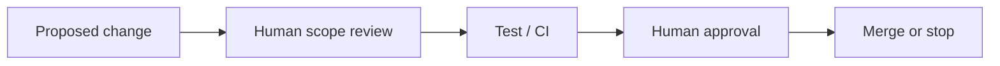

# 安全性と承認ゲート

## なぜ承認ゲートが必要か

AIは候補の生成・整理・検証支援には有効ですが、外部への送信、公開、契約、金額・納期確約などは、誤りが直接の損害や情報漏えいにつながります。

そのため、重要な操作を「AIが実行してよい操作」と「人間が最終判断する操作」に分けます。

## 承認が必要な操作

| 操作 | 承認の理由 |
| --- | --- |
| 外部サービスへの送信・確定 | 送信先・内容・公開範囲の誤りを防ぐ |
| 公開リポジトリへの機密情報を含む変更 | 情報漏えいを防ぐ |
| 契約、金額、納期の確約 | 法的・金銭的・信用上の影響がある |
| 納品、決済、削除、権限変更 | 復元困難または高影響の操作である |
| 要件・公開範囲・優先順位の大きな変更 | 目的逸脱を防ぐ |

## 秘密情報の分離

- APIキー、トークン、認証情報をソースコードや公開資料へ含めない
- 環境変数や非公開設定を分離する
- 実データ、顧客情報、PrivateプロジェクトのURLや内部設計を公開資料へ移さない
- 調査・レビュー用の入力でも、公開可否と必要最小限性を確認する

## 変更の安全な流れ

テスト成功は、公開・マージ・外部確定の自動承認を意味しません。テストは品質判断の一要素であり、目的・公開範囲・影響はHumanが確認します。
